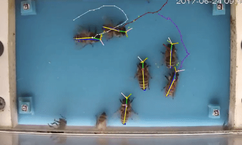

beepose
==============================





Welcome to beepose the repo to perform multiple animal pose estimation and tracking. 

### Docker

#### Dependecies
- Docker 19.03
- [nvidia-docker](https://github.com/NVIDIA/nvidia-docker)
 
 
To build the image you should run:

`
docker build -t <IMAGE_NAME> .
`

And for run the container you need to run

`
docker run --gpus all -it <IMAGE_NAME> /bin/bash
`

Maybe you want to add a volume (attach a folder to the container) to the docker container you can do it in the following way:
 
`
docker run --gpus all  -v <host absolute path>:<container absolute path> -it <IMAGE_NAME> /bin/bash
`
Example:
`
docker run --gpus all  -v /home/user/data:/home/beepose/input_data -it beepose_image /bin/bash
`


How to start?
---------------

#### Getting Example data

You can start by training with our dataset for pose estimation on bees.  Create a data folder and download the data from [this](https://drive.google.com/file/d/1cHgE6IN7axVVdMv4HIOJrpdVKR2BvlgJ/view?usp=sharing)
source . Here you can find a trainig dataset for honey bees that will help as an example. You will also find a folder of small videos to use for testing inference. 


#### Creating your own data.

To create your own data, make sure you have an annotations file that follows [COCO](http://cocodataset.org/#format-data) convention. Also have a folder with the images to be used. 


### Start training

To train go to the train folder in beepose. 

````
    cd beepose/train
```` 
Now you just need to run the following script that would read the annotations file and automatically set the parameters according to the configuration in the annotations file. 

In this script you will have to point to the path where the annotations and the images are. 


````
usage: train_stages_aug.py [-h] [--stages STAGES] [--folder FOLDER]
                           [--gpu GPU] [--gpu_fraction GPU_FRACTION]
                           [--ann ANN] [--imgs IMGS] [--batch_size BATCH_SIZE]

optional arguments:
  -h, --help            show this help message and exit
  --stages STAGES       number of stages (2,3,4,5,6)
  --folder FOLDER       "Folder to  to save this training"
  --gpu GPU             what gpu to use, if "all" try to allocate on every gpu
  --gpu_fraction GPU_FRACTION
                        how much memory of the gpu to use
  --ann ANN             Path to annotations
  --imgs IMGS           Path to images folder
  --batch_size BATCH_SIZE
                        batch_size
````

### Some notes on limb configuration

Default 5 parts for bees uses parameters:
```
np1=6,np2=10,numparts=5,mapIdx=[[0,1],[2,3],[4,5],[6,7],[8,9]],limbSeq=[[1,3],[3,2],[2,4],[2,5],[1,2]]
```

- `numparts` is number of parts
- `numpafs` should be `np2/2`
- `np1` is number of heatmap channels parts (1 per part + 1 for background)
- `np2` is number of PAF channels for connections (2 per connection)
- For a connection `k` (`k=0..numpafs-1`), defined as (point1, point2):
   - `mapIdx[k]` is PAFs channel IDs for connection k (value in 0..np2-1), in the form of a pair `[channelId1, channelId1]`
   - `limbSeq[k]` is part IDs for connection k (value in 1..numparts), in the form of a pair `[partId1, partId2]`
   
Inference 
---------

You may not need to run the full pipeline and maybe just want to perform detection on video or static images. You can process one video using the script in 'beepose/inference/inference_video.py'. Also if you only have statics images you can use the script on 'beepose/inference/process_folder_image.py' which only takes the containing folder where the images are located. 

Pipeline 
--------

Once the model is trained. You can start the pipeline processing. By default the pipeline performs all the following actions, if you only would like to perform detection at some video and tracking, you can call the script at the end of this sections with event_detection=False and the same for pollen detection. 

The pipeline consists on the following steps: 

1. **Detection** : Process all videos in a folder. Creating an output file called "merged_nameofvideo_detections.json". With the following structure: 

    ````
    {
    -frame_idx(int): {-parts(str):{
                            -part_number(int):[[x,y,score],...],
                            ...}
                     -'mappings':[[[x1(float),y1(float)],[x2(float),y2(float)],score(float),angle(float),[type_part_0(int),type_part_1(int)]],...]}
    .
    .
    .
    }
    ````
    
2. **Tracking**: Taking as input the detections file, tracking will create 2 new tracking files, that will contain the information for tracking: 
    
    * track_file: This file contains a lookup table indexed by the frame number and where each row will contain the track id of the indexed part detection. This is the structure of these files. 
    ````
        -[frame_idx (int):[idx1,...]...]
    ````
    * id_track_file: This file contains the information about each track. It is indexes by the id of the track and contains information of the positions of that track and where it started. The following, is the structure of these files. 
    
    ````
    
        - {
            -id_track: { -'positions':[[x1,x2], ...]
                         -'init_frame': starting_frame(int)
        
                        }
    }
    ````
    

For example:
    ```
        trk = load_json(trk_path)
        trk[10][2]
    ```
Will print the id of the track for  the detected part that is located on the frame 10 and in the index 2. To see all the positions regarding this track you can :
    
    ````
        trk_id = load_json(trk_id_path)
        trk_id[trk[10][2]]
    ````
Which return the information about the starting frame of the track and the positions after this frame.
    
There are two types of tracking available Hungarian (basic frame to frame assignment) and Kalman filtering (constant velocity model). You can specify wich tracking to use. 

If Hungarian is used the output files will be "track_nms_merged_name of video_detections.json" and "id_nms_track_name of video_detections.json". If kalman tracking is used the files will be "merged_nameofvideo_detections.kalman_tracks.json" and "merged_nameofvideo_detections.id_kalman_tracks.json". Both with the same structure. 


3. **Event Detection**: 
    
    Based on the rules for entrance and exit definition and using the tracking files already processed, the event detection part will take each track and classify into entrances and exits. There are three files as output: 
    -Count_v2_id_nms_track_merged_nameofvideo_detections.json: 
    Containing an aggregated count of the events. With the following structure: 
    ````
        -{event1(str):count(int)
            .
            .
            .
    }
    ````
    
    - TRK_class_id_nms_track_merged: Containing the tracks id and its classification. With the following structure
        ````
        - {event1(str):[trackid1,...]}
        ````
    
    - EVENT_complete_v2_merged_nameofvideo_detections.json: An event v2 version file that is compatible with the labelbee interface. 

4. **Pollen Detection**: 
    
    The pollen detection will take place here. This will take as input the detections file and the tracking file. It will output the classification for each of the tracks in a file called "trk_pollen_merged_nameofvideo_detections.json" with the following structure:
    
    ````
    - trkid: [[classification,score,frame], ....]
    ````
5. **Update Events** 

    With the pollen detection now we can update the events based on this detection. We simply have a voting schema based on the results for the pollen classification at every stage. 
    

6. **Actograms** : 

Once all the previous 5 steps were taken. You can use the notebook for actograms to visualize the result. You just need to load all the count files. 

Performing all the previous pipeline can be done using the process_full_video.py script. In the following way:


````
usage: process_folder_full_video.py [-h] [--videos_path VIDEOS_PATH]
                                    [--GPU GPU] [--GPU_mem GPU_MEM]
                                    [--model_day MODEL_DAY]
                                    [--model_nigth MODEL_NIGTH]
                                    [--model_pollen MODEL_POLLEN]
                                    [--output_folder OUTPUT_FOLDER]
                                    [--sufix SUFIX]
                                    [--tracking {hungarian,kalman,both}]
                                    --model_config MODEL_CONFIG [--part PART]
                                    [--process_pollen] [--event_detection]
                                    [--debug DEBUG]

optional arguments:
  -h, --help            show this help message and exit
  --videos_path VIDEOS_PATH
                        input folder path where the videos are
  --GPU GPU             GPU number for the device. If you want to use more
                        than one, separate by commas like 0,1,2 etc
  --GPU_mem GPU_MEM     Memory available
  --model_day MODEL_DAY
                        path to day model
  --model_nigth MODEL_NIGTH
                        path to night model
  --model_pollen MODEL_POLLEN
                        path to night model
  --output_folder OUTPUT_FOLDER
  --sufix SUFIX         Sufix to identify the detection
  --tracking {hungarian,kalman,both}
  --model_config MODEL_CONFIG
                        Model config json file
  --part PART           Index id of Part to be tracked
  --process_pollen      Whether to apply pollen detection separately. Default
                        is True
  --event_detection     Whether to apply event detection. Default is True
  --debug DEBUG         If debug is True logging will include profiling and
                        other details

````

7. **Standard input for processing pollen and tag together**
Using the already trained model for tag detection you can use the following recipe 
```
python process_folder_full_video.py --videos_path ../../../src/Data/Videos/trash/processed/ --GPU=1 --GPU_mem 12 --tracking both  --model_day ../../models/pose/Complete_tag_2_16_8.best.h5 --np1 16 --np2 8 --numparts 8 --part 1 --process_pollen False
```
Data Formats
-----------

Project Organization
------------

    ├── LICENSE
    ├── Makefile           <- Makefile with commands like `make data` or `make train`
    ├── README.md          <- The top-level README for developers using this project.
    ├── data
    │   ├── external       <- Data from third party sources.
    │   ├── interim        <- Intermediate data that has been transformed.
    │   ├── processed      <- The final, canonical data sets for modeling.
    │   └── raw            <- The original, immutable data dump.
    │
    ├── docs               <- A default Sphinx project; see sphinx-doc.org for details
    │
    ├── models             <- Trained and serialized models, model predictions, or model summaries
    │
    ├── notebooks          <- Jupyter notebooks. Naming convention is a number (for ordering),
    │                         the creator's initials, and a short `-` delimited description, e.g.
    │                         `1.0-jqp-initial-data-exploration`.
    │
    ├── references         <- Data dictionaries, manuals, and all other explanatory materials.
    │
    ├── reports            <- Generated analysis as HTML, PDF, LaTeX, etc.
    │   └── figures        <- Generated graphics and figures to be used in reporting
    │
    ├── requirements.txt   <- The requirements file for reproducing the analysis environment, e.g.
    │                         generated with `pip freeze > requirements.txt`
    │
    ├── setup.py           <- makes project pip installable (pip install -e .) so src can be imported
    ├── src                <- Source code for use in this project.
    │   ├── __init__.py    <- Makes src a Python module
    │   │
    │   ├── data           <- Scripts to download or generate data
    │   │   └── make_dataset.py
    │   │
    │   ├── inference           <- Scripts to perform inference
    │   │   |
    │   │   └── process_folder_full_video.py  <- Runs the inference applied to a folder of videos.  
    │   │   └── inference.py <- master script for inference algorithm 
    │   │   └── inference_video.py <- perform inference on video, or a fragment of the video. 
    │   │
    │   ├── features       <- Scripts to turn raw data into features for modeling
    │   │   └── build_features.py
    │   │
    │   ├── models         <- Scripts to train models and then use trained models to make
    │   │   │                 predictions
    │   │   ├── predict_model.py
    │   │   └── train_model.py
    │   │
    │   └── visualization  <- Scripts to create exploratory and results oriented visualizations
    │       └── visualize.py
    │
    └── tox.ini            <- tox file with settings for running tox; see tox.testrun.org


--------

<p><small>Project based on the <a target="_blank" href="https://drivendata.github.io/cookiecutter-data-science/">cookiecutter data science project template</a>. #cookiecutterdatascience</small></p>

